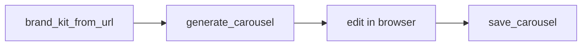
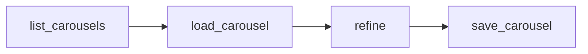
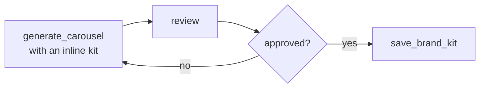
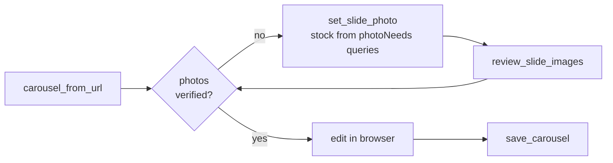
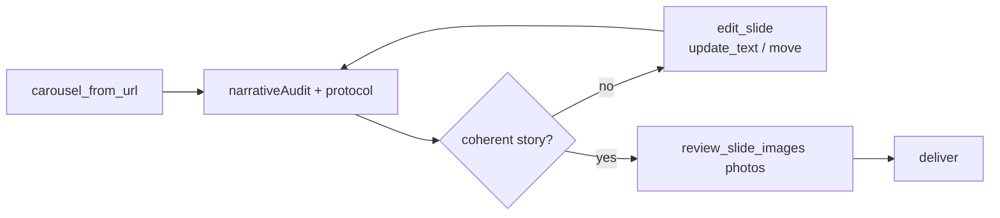

# Carousel Generator

Create on-brand social media carousels with AI, then edit them in a visual HTML editor.

Carousel Generator is an MCP server plus a browser-based editor. You can use it from Claude Desktop, Claude Code, Codex, OpenCode, Cursor, or any MCP-compatible client.

## What can I use it for?

Carousel Generator is useful when you need to:

- Create Instagram, LinkedIn, Facebook, or TikTok slide content from a short brief.
- Keep every carousel consistent with a brand's colors, fonts, logo, and visual style.
- Create several carousels for different companies or clients.
- Turn one idea into feed, square, and story formats.
- Reopen an old carousel and refine its copy, photos, layout, or brand kit.
- Generate a brand kit from an existing website.
- Let an AI agent create and update carousels without manually writing HTML or CSS.
- Export finished slides as PNG images or a PDF.

## Why is it useful?

It combines three things in one workflow:

1. **AI generation**: describe the topic, audience, tone, and number of slides.
2. **Visual editing**: open the result in a browser and change text, order, photos, layout, and styles.
3. **Reusable data**: save brand kits, carousel JSON, and image assets so the work can be loaded and refined later.

The result is editable HTML, not a flat image. You can change the content after it is generated.

## How it works

1. An MCP client sends a request to the Carousel Generator server.
2. The server creates slides from your content and an optional brand kit.
3. It writes an editable HTML file and opens it in your browser.
4. The browser editor lets you edit the slide directly or use the inspector panel.
5. The server can also save a structured `carousel.json` and its assets for later use.

You do not need to know HTML, CSS, JSON, or design systems to use the basic workflow.

## Quick start

### Requirements

- Node.js 18 or newer.
- An MCP-compatible client such as Claude Desktop, Claude Code, Codex, OpenCode, or Cursor.
- Internet access for the editor's web components, fonts, and export libraries.

### Install

Run this command from the repository folder:

```bash
node install.mjs
```

To install for one specific client:

```bash
node install.mjs --opencode
node install.mjs --claude-code
node install.mjs --claude-desktop
node install.mjs --codex
node install.mjs --cursor
```

Restart the MCP client after installation. Local MCP servers are started when the client starts.

> **Claude Desktop:** use this server from **Cowork**. The Chat tab does not run local MCP tools.

### Your first request

You can ask your AI client something like:

> Create a 7-slide 4:5 Instagram carousel for a local fishing shop. Use a strong hook, short readable body copy, one idea per slide, and finish with a clear call to action.

The agent can call `generate_carousel` for you. The generated HTML opens in your browser, usually in `~/Downloads`.

## The normal workflow

### 1. Set up a brand kit

You can start with an available example kit, create a kit yourself, or inspect a website:

> Create a brand kit from `https://example.com` and save it as `example`.

Website extraction only analyzes the homepage. It uses simple heuristics, reports confidence for each field, and should be reviewed before final use.

### 2. Generate a carousel

Give the agent the topic, audience, format, number of slides, tone, and brand kit:

> Create a 5-slide square LinkedIn carousel about reducing energy costs for manufacturers. Use the `example` brand kit and keep the copy direct.

Supported starting formats:

| Format | Size | Typical use |
|---|---:|---|
| `feed` | 1080 x 1350 | Instagram and LinkedIn feed posts |
| `square` | 1080 x 1080 | Instagram and LinkedIn square posts |
| `story` | 1080 x 1920 | Stories, Reels, and TikTok-style vertical content |

You can change the format later in the editor.

### 3. Edit in the browser

The editor supports:

- Click-to-edit text directly on a slide.
- Live mini-slide previews in the sidebar: each thumbnail is the real slide rendered at the selected format's aspect ratio (4:5, 1:1, 9:16), so what you see in the nav is what you get.
- An inspector panel for backgrounds, layout, and nested blocks.
- Drag and drop to reorder slides and content blocks.
- Add, remove, or reorder text, highlights, body copy, lists, pills, and CTA boxes.
- Per-slide gradients, custom CSS backgrounds, or photos.
- Photo focal points so the subject stays visible when the format changes.
- A dark scrim over photos when text needs more contrast.
- Optional golden-ratio guides and story safe-zone guides.

Text supports a small amount of formatting:

- `**bold text**` creates bold text.
- `==highlighted text==` creates a brand-color highlight.

### 4. Export

Use the controls under each slide to export one PNG, or use the top toolbar to export all PNGs or a PDF.

### 5. Save and refine

For an agent-driven workflow, use the saved carousel tools:

> List my saved carousels, load the latest one for `example`, and make the body copy shorter.

The initial generation and MCP save operations create a persistent JSON document. The browser editor also keeps its current state in browser storage and has a JSON export. To update the persistent MCP carousel after an agent-driven change, use `save_carousel`.

## MCP tools

The server exposes nineteen tools. You can ask the AI to use them in plain language; you do not need to call them manually.

| Tool | Use it when you want to... |
|---|---|
| `generate_carousel` | Create a new editable carousel and open it in the browser. |
| `carousel_from_url` | Build a draft carousel from an article/note URL, with photos assigned from the article. |
| `list_carousels` | See the saved carousels, grouped by company. |
| `load_carousel` | Reopen an existing carousel with its photos and logo resolved. |
| `save_carousel` | Create or update the persistent nested JSON and copy assets into its asset folder. |
| `edit_slide` | Edit slides without touching raw JSON: update text, move/reorder, duplicate, delete, or add a new blank slide (`add` + template). |
| `set_slide_bg` | Change a slide's non-photo background: kit gradient, custom CSS, or reset to the kit's default gradient. |
| `set_carousel_meta` | Update carousel meta only: title, format (feed/square/story + canvas), category, showCount. |
| `validate_carousel` | Dry-run quality audit (narrativeAudit + styleWarnings) without writing or re-rendering. |
| `import_editor_state` | Import the editor's Push-to-MCP JSON (or a v2 carousel) back into `carousel.json`. |
| `render_preview` | Render slides to real PNGs with headless Chromium (`4:5`, `1:1`, `9:16`; all slides or selected indices). |
| `social_copy` | Generate captions, hooks, hashtags, and per-slide alt text for Instagram/LinkedIn/X (es-AR heuristics; prefers `source.md`). |
| `delete_carousel` | Permanently delete a saved carousel and its assets. Two-step: without `confirm:true` it only returns a preview; the second call with `confirm:true` deletes. The AI should ask you before confirming. |
| `review_slide_images` | Audit the photos of a saved carousel: per-slide texts, assigned photo, `photoNeeds`, and `narrativeAudit`. |
| `set_slide_photo` | Replace the background photo of one slide (from a URL or a local file) and re-render. |
| `save_brand_kit` | Create or update a reusable brand kit. Partial updates are merged. |
| `list_brand_kits` | See all personal and example brand kits available to the editor. |
| `load_brand_kit` | Inspect the complete JSON of one brand kit. |
| `brand_kit_from_url` | Infer a brand kit from a website homepage and optionally save it. |

### Common tool flows

**Start from a website**



**Continue an existing project**



**Try a new look without changing the saved kit**



**Build a carousel from an article URL**



### Photo verification protocol

`carousel_from_url`, `review_slide_images` and `set_slide_photo` embed a
**PHOTO REVIEW PROTOCOL** in their response. The server resolves photos with
local heuristics only (it cannot see images), so the agent is responsible for:

1. **Verify** — look at every assigned photo and confirm it matches the slide's message (kicker/title/body). Article images can be infographics, logos, or banners that look wrong as slide backgrounds.
2. **Replace** — for photos that do not fit (or `photoNeeds` entries): search stock photos with the suggested query (free-license sources like Unsplash/Pexels), download and visually verify the candidate, then apply it with `set_slide_photo`.
3. **Re-audit** — run `review_slide_images` again and confirm every slide ends up with a coherent photo before delivering.

`carousel_from_url` discards images whose filename hints at
infographics/logos/banners (`flyer`, `infograf`, `logo`, `banner`, `icon`,
etc.) and reports every discarded candidate to stderr for diagnostics.

### Narrative review protocol

`carousel_from_url`, `save_carousel`, `load_carousel` and `review_slide_images` embed a
**NARRATIVE REVIEW PROTOCOL** so the agent validates that the generated slides
actually tell a coherent story with a common thread — not a pile of random
slides. The server cannot judge meaning itself (same constraint as photos), so
it combines structured signals with an explicit agent checklist:

1. **Read** — read kicker, title, highlight and body of every slide in order (1..N).
2. **Common thread** — confirm every slide talks about the same subject/topic as the note; no filler slides disconnected from the cover or title.
3. **Arc** — full arc present: cover (hook) → development → cta (end). Order is linear, never going backwards.
4. **Cohesion** — each slide connects to the previous one (logical bridge or sequence), no random topic jumps.
5. **Fix** — if something fails: rewrite or reorder with `edit_slide` (`update_text` | `move`) and re-audit before delivering.

Alongside the protocol, the tools return a machine-readable **`narrativeAudit`**
`{ ok, flags }` with objective starting points:

- **Solid flags** (almost certainly real): `missing-cover`, `missing-cta`, `cta-in-middle`, `multi-cover`, `duplicate-figure` (same figure on several slides), `repeated-kicker` (same kicker on several slides = filler signal).
- **Advisory flag** (low confidence): `orphan-slide` — a slide sharing no significant tokens with the cover/title. The agent should *review* it, not treat it as definitely wrong.

Typical flow:



### Highlight colors by category

The background color of **highlight** blocks is not hard-wired to the kit's primary color. It is resolved per slide with this cascade:

1. `style.background` on the highlight block itself (manual per-slide override).
2. `kit.highlightColors[meta.category]` — an optional category → color map defined in the brand kit.
3. `kit.colors.primary` — the kit's primary color (current default behavior).

**Set it up:**

- Add a `highlightColors` object to the brand kit (or edit it in the kit dialog of the browser editor):

```json
{
  "name": "Acercando Naciones",
  "colors": { "primary": "#be0f0f", "..." : "..." },
  "highlightColors": {
    "turismo": "#0e7c66",
    "diplomacia": "#1f4e79",
    "comercio internacional": "#be0f0f"
  }
}
```

- Set the carousel's category via `generate_carousel { category: "Turismo" }` (stored as `meta.category`), or edit it in the editor's **Categoría** section. Category matching is case-insensitive.
- Per-slide overrides always win: change the color of a single highlight with the color picker next to the block in the editor.

**Category detection in `carousel_from_url`** (best-effort, generic — not site-specific):

1. `<meta property="article:section" content="...">` (Open Graph standard).
2. A schema.org `BreadcrumbList` JSON-LD block (first non-home item).
3. Taxonomy links inside the article (`<article>`/`<main>` only, so global nav is excluded) with common path segments: `/category/`, `/categories/`, `/categoria/`, `/categorias/`, `/seccion/`, `/tema/`, `/tag/`. The most frequent label wins.
4. Nothing found → the tool reports `categoría no detectada` and the carousel is generated without a category (highlights fall back to the primary color).

The tool output always states which signal detected the category and which color was applied.

### Automatic content rules

- **Long words auto-shrink** — a highlighted word wider than the slide (e.g. "FINANCIAMIENTO" at hero size) is never broken mid-word. After every render, headlines are measured and any word that would not fit gets its font size reduced proportionally (min 60%). Highlight blocks (`.orange`) also shrink if the phrase would wrap beyond ~2 lines at hero size. Phrases that wrap normally within 2 lines are left untouched.
- **List partitioning** — a `list` slide accepts at most **3 items**. When generating or saving, longer lists are automatically split into consecutive slides (same photo, kicker annotated with `PARTE X`). In the editor, lists over the limit show a warning and a **Dividir** button in the slide controls.
- **Bold key figures** — when generating, numeric data in body copy is wrapped in bold automatically: currency amounts (`US$ 1.099 millones`), percentages (`+6,9%`), figures with units (`6 meses`), and spelled-out numbers (`seis meses`). Texts that already contain manual `**bold**` or `==highlight==` markup are left untouched.
- **Long highlight warning** — `generate_carousel`, `carousel_from_url` and `save_carousel` flag highlights longer than ~28 chars still at `sizePct >= 90` (`rule: "highlight-largo"`) because they tend to break badly; lower the `sizePct` or shorten the text.

### Regla de estilo de textos (lint, no bloqueante)

Los copys del carrusel no deben sonar a IA. `generate_carousel`, `carousel_from_url` y `save_carousel` analizan kicker, títulos, highlights, bodies, slogans e items y devuelven `styleWarnings` (o una sección "Advertencias de estilo") cuando encuentran:

- **Raya larga (—)** — usá coma, punto o guion corto (-).
- **Contrastes "no es X, es Y" / "no solo X, sino Y"** — afirmá directo, sin negar primero.
- **Clichés** — "en un mundo", "cabe destacar", "es importante destacar/señalar", "no cabe duda", "al siguiente nivel", "punto de inflexión": reformulá con palabras propias.

El agente debe corregir cada advertencia antes de entregar el carrusel.

## Templates and slide content

The generator includes five starting templates:

| Template | Best for |
|---|---|
| `cover` | A strong opening hook or hero statement. |
| `fact` | A number, insight, or fact with supporting items. |
| `map` | Locations, places, or a light visual layout with pills. |
| `list` | Several tips, steps, features, or examples. |
| `cta` | A final call to action with a branded closing box. |

You can provide simple slide fields such as `eyebrow`, `titleWhite`, `titleOrange`, `paragraphs`, `items`, `pills`, `ctaBox`, `slogan`, and `foot`.

For full control, provide `elements`. This is the nested block tree used by the editor. It supports blocks such as `brand`, `count`, `stack`, `text`, `highlight`, `body`, `items`, `item`, `box`, `pill`, `slogan`, and `foot`.

## Brand kits

A brand kit stores the visual rules that should be reused across carousels:

- Primary, secondary, tertiary, and slide background colors.
- Heading and body fonts.
- Google Fonts URL, when needed.
- Logo image or letter fallback.
- Brand gradients.

Personal kits live here:

```text
~/.carousel-generator/brand/<company>/kit.json
~/.carousel-generator/brand/<company>/logo.png
```

Personal kits have priority over repository example kits. The built-in Default kit is used when no other kit is available.

## Saved files

By default, persistent carousels live here:

```text
~/.carousel-generator/carousels/<company>/<carousel-name>/
├── carousel.json
├── source.md          # optional: from carousel_from_url (url, title, curated description)
├── social.md          # optional: from social_copy { save: true }
├── previews/<format>/ # render_preview PNGs + preview HTML
└── assets/
    ├── logo.png
    └── slide-1-background.jpg
```

The JSON stores the content, format, brand snapshot, layout, block tree, and asset references. Images are copied into `assets/` instead of being stored as large base64 strings in the JSON.

Generated HTML files are normally written to:

```text
~/Downloads/
```

You can change the output directory with the `outputDir` option.

## A few useful requests

```text
Create a 6-slide feed carousel about our new product. Use the hooked kit, keep each slide under 18 words, and include a final CTA.
```

```text
Load the latest carousel for acme, make the headlines shorter, and keep the existing photos and brand colors.
```

```text
Create a story version of this carousel. Keep the subject visible, use the safe zone, and add a darker photo scrim for readability.
```

```text
List the available brand kits and show me which one has a logo image.
```

## Troubleshooting

### The tools do not appear in my AI client

Restart the client after running `install.mjs`. The server is started at client startup.

### The HTML opens but some editor features are missing

Keep internet access available. The editor loads Material Web components, fonts, `html2canvas`, and `jsPDF` from CDNs.

### A brand kit does not look exactly like the website

`brand_kit_from_url` only analyzes the homepage and uses heuristics. Review the returned confidence values, preview the kit, then refine colors, fonts, gradients, or the logo with `save_brand_kit`.

### A photo is not found

Use an absolute path prefixed with `file:` or a path relative to the company's brand folder. Supported image formats include PNG, JPG, WEBP, GIF, and SVG for logos.

### The assigned photos do not match the content

`carousel_from_url` picks article images with filename heuristics; it cannot judge what an image shows. Follow the photo verification protocol returned by the tool: look at each photo, replace the ones that do not make sense (search stock with the `photoNeeds` queries) using `set_slide_photo`, and re-audit with `review_slide_images`.

### A list slide lost its last items

Slides render at most 3 list items comfortably; longer lists are split automatically on generation. For a carousel edited by hand, use the **Dividir** button in the slide controls (or ask for the slide to be split) so every item stays readable in every format.

### I edited the browser version but the saved JSON did not change

The browser editor keeps its live state in browser storage. Two options:

1. **Push al MCP** — use the toolbar button **Push al MCP** to copy `{action, company, name, carousel}` (with base64 photos) and call `import_editor_state` with that payload; assets land in `assets/` and the HTML re-renders.
2. **Manual export** — use the editor's JSON export and call `save_carousel` with the updated carousel data.

### How do I export real PNGs from the agent?

Ask: *"dame el carousel en 4:5 todos los PNGs"* → `render_preview { format: "4:5" }` (aliases `4:5|feed`, `1:1|square`, `9:16|story`; omit `slides` for all). PNGs are written under `previews/<format>/slide-NN.png`. The server prefers Playwright's arm64 `chrome-headless-shell`, then Chrome/Chromium; override with `CHROME_PATH`.

### How do I get captions/hashtags for posting?

`social_copy` returns hooks, captions per platform (default Instagram + LinkedIn), hashtags, and alt text ≤125 chars per slide. Priority: `source.md` → slides → meta. Pass `save: true` to also write `social.md`.

## Advanced: nested carousel data

Each saved carousel is a portable `carousel.json` document. A slide contains an ordered `elements` tree. Every block can have text, style, position, and children.

```json
{
  "id": "slide-1",
  "template": "cover",
  "bg": { "type": "photo", "asset": "assets/slide-1-background.jpg" },
  "elements": [
    { "id": "brand-1", "type": "brand", "style": { "topPct": 3.8, "leftPct": 6.2 } },
    {
      "id": "stack-1",
      "type": "stack",
      "style": { "anchor": "bottom", "widthPct": 87.6 },
      "children": [
        { "id": "text-1", "type": "text", "text": "WHITE TITLE" },
        { "id": "highlight-1", "type": "highlight", "text": "ORANGE TITLE" },
        { "id": "body-1", "type": "body", "text": "Short supporting copy." }
      ]
    }
  ]
}
```

The preferred visual hierarchy is a smaller white title, a larger highlighted title, and readable body copy. The editor uses golden-ratio spacing and type scale as a starting point, while allowing each block to be adjusted.

## MCP bundle

To create a one-click-installable bundle for Claude Desktop or another MCPB-compatible client:

```bash
npm run bundle
```

This creates `dist/carousel-generator.mcpb`.

## Development

There is no build step for the app or server. The main files are:

- `app/index.html`: browser editor and renderer.
- `mcp/server.mjs`: MCP bootstrap on `@modelcontextprotocol/sdk` (stdio, JSON Schema tools).
- `mcp/registry.mjs`: single dispatch — the 19 tools, ajv validation of `arguments`, and `callTool`.
- `mcp/lib/validate.mjs`: ajv runtime validation (strict `additionalProperties` on root + nested-with-properties; freeform bare objects like `carousel`/`kit` stay open). Errors are Spanish, returned as `isError` before the handler runs.
- `mcp/tools/*.mjs`: one file per tool (`{ name, description, inputSchema, handler }`).
- `mcp/lib/*.mjs`: shared helpers (paths, kits, narrative, images, persist, render, …).
- `mcp/kits/`: repository example brand kits.

Tests and checks (also run by `npm test` and CI):

```bash
npm test                              # syntax + manifest sync + node:test + smoke + tools e2e + fixture
npm run test:unit                     # tests/lib + tests/tools
npm run test:integration              # JSON-RPC + verifier tests
npm run test:tools                    # MCP tools end-to-end (needs Chrome for PNGs)
npm run test:fixture                  # offline fixture server
node scripts/fixture-server.mjs &     # then: npm run test:from-url
npm run sync:manifest                 # regenerate manifest.json tools[]
npm run test:sync                     # fail if manifest is out of sync
```

Useful env vars:

- `CAROUSEL_GENERATOR_HOME` — override `~/.carousel-generator` (tests and agent-e2e isolate here).
- `CAROUSEL_TOOL_LOG` — JSONL log of every `tools/call` (`{ name, ok, durationMs, … }`).
- `CHROME_PATH` — force a Chrome binary for `render_preview`.

### CI

`.github/workflows/ci.yml` runs three jobs:

1. **unit** — syntax, `sync-manifest --check`, `node --test`, editor smoke.
2. **tools-e2e** — JSON-RPC tools test with `chrome-headless-shell`, plus offline `*_from_url` against `scripts/fixture-server.mjs`.
3. **agent-e2e** — installs the opencode CLI, runs a free-model agent (`OPENCODE_MODEL`, default `opencode/mimo-v2.6-flash-free`) that must exercise all 19 tools, then `scripts/verify-agent-output.mjs` checks `CAROUSEL_TOOL_LOG` coverage (19/19 `ok:true`) and artifacts (`carousel.json`, kits, PNGs, `social.md`, `source.md`). The job exit code is the **verifier's**, not the model's. Artifacts upload on failure for debugging.

```bash
# local agent e2e (requires opencode CLI + fixture server):
node scripts/fixture-server.mjs 8765 &
node scripts/run-agent-e2e.mjs --log /tmp/calls.jsonl --home /tmp/home --artifacts /tmp/art
node scripts/verify-agent-output.mjs --log /tmp/calls.jsonl --home /tmp/home
```

Commits use Conventional Commits and are checked by commitlint and husky.
